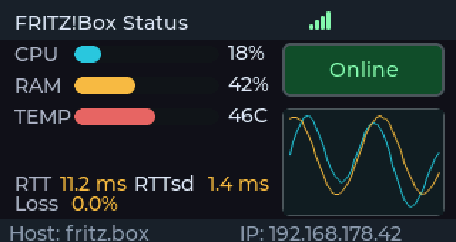
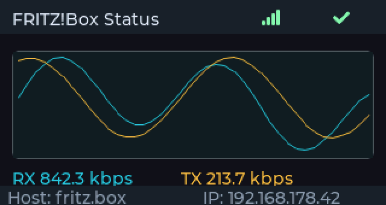
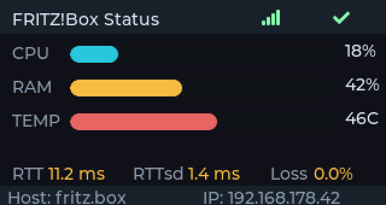

# fritzbox-status-esp32

A small ESP32 dashboard that shows live FRITZ!Box WAN/gateway status, traffic and connection quality on a TFT display - no PC, phone or browser tab required. Configuration happens through a captive Wi-Fi portal, and firmware updates are pulled directly from this repository's GitHub releases.

This is a sibling project of [pfsense-status-esp32](https://github.com/UniqueDroid/pfsense-status-esp32), swapping the pfSense REST API integration for AVM's FRITZ!Box TR-064 (SOAP/UPnP) API. The captive-portal config flow, board-profile system and OTA update mechanism are shared with that project.

Supports multiple board profiles out of the box (LilyGO T-Display S3, CYD 2.8"), so adding another display is a matter of writing one new board header, not touching the application code.

## Screenshots

The following are pixel-accurate mockups rendered from the real UI code with a native SDL2 simulator (see [tools/ui_simulator](tools/ui_simulator)), not photos - useful since the actual layout doesn't need physical hardware to preview. Cycle through them on the device with the button (see [Features](#features)).

| Dashboard | Traffic graph | Metrics |
| --- | --- | --- |
|  |  |  |
| Compact overview: CPU/RAM/temperature bars, WAN online/offline status and a mini traffic chart. | Full-width RX/TX chart for the WAN interface. | Enlarged CPU/RAM/temperature bars plus RTT, jitter (RTTsd) and packet loss. |

## Features

- Captive portal for first-time setup (AP SSID `FritzBox-Status-AP`), password-gated web menu for subsequent access
- Wi-Fi credentials and FRITZ!Box host persisted in NVS (`Preferences`)
- Gateway status via the FRITZ!Box TR-064 SOAP/UPnP API: online/offline, round-trip time, jitter, packet loss
- WAN traffic history (RX/TX) sampled from TR-064 interface byte counters and rendered as a live chart
- Three-screen live dashboard (NerdMiner-inspired layout), cycled with a physical button; second button cycles display brightness
- Self-updating: checks this repo's GitHub releases periodically and shows an update badge; installing a release verifies the downloaded firmware's SHA256 checksum (from GitHub's release asset digest) before committing the OTA write, so a corrupted or tampered download is discarded instead of booted
- Factory reset (erase Wi-Fi + FRITZ!Box config) from the web menu
- Optional Telegram bot integration: WAN down/up and threshold alerts, a periodic status digest with configurable interval and quiet hours, a daily min/max summary, proactive firmware-update and boot notifications, and on-demand chat commands (see [Telegram bot](#telegram-bot-optional))

## Requirements

- A supported ESP32 board:
  - LilyGO T-Display S3 (`lilygo-t-display-s3`)
  - CYD 2.8" / 2432S028 (`cyd-2432s028`)
- [PlatformIO](https://platformio.org/) (CLI or the VS Code extension)
- A FRITZ!Box reachable on the local network with TR-064 access enabled (Home Network → Network → Network Settings → "Allow access for applications" in the FRITZ!OS UI - enabled by default on most models)

## Quick start

1. Pick the matching PlatformIO environment:
   - LilyGO: `lilygo-t-display-s3`
   - CYD: `cyd-2432s028`
2. Build and flash the project with PlatformIO.
3. On first boot, connect to the `FritzBox-Status-AP` Wi-Fi network.
4. Open `192.168.4.1` in a browser.
5. Enter your home Wi-Fi credentials and the FRITZ!Box host/IP, then save.
6. The device reconnects to your network and starts showing live status data.

## Firmware updates

The device periodically checks `https://api.github.com/repos/UniqueDroid/fritzbox-status-esp32/releases/latest` and shows an update badge on the dashboard when a newer tagged release is available. Triggering the update from the web menu:

1. Downloads the release's `.bin` asset over HTTPS and streams it directly into the inactive OTA partition.
2. Computes a SHA256 hash of the downloaded bytes while streaming, and compares it against the checksum GitHub reports for that asset (the release API's `digest` field).
3. Only marks the new partition bootable if the hashes match; on a mismatch, the write is discarded and the device keeps running its current firmware.

## Telegram bot (optional)

The device can push alerts and answer status queries through a Telegram bot, talking directly to the Telegram Bot API over HTTPS - no third-party server involved. The whole feature is opt-in: leave the bot token or chat ID empty and it stays fully inactive with zero effect on the rest of the firmware.

### What it does

- **Alerts** (sent once per state change, not spammed): WAN down/up, packet loss above a threshold, temperature above a threshold.
- **Status digest**: a WAN/CPU/RAM/temperature summary sent on a configurable interval, with an optional quiet-hours window (mutes only the digest; alerts still come through).
- **Daily summary**: once a day, a min/max recap of CPU, temperature, packet loss and WAN-down events.
- **Proactive notifications**: a new firmware release becomes available, or the device just booted.
- **Chat commands** - message the bot directly:
  - `/status` - current WAN/CPU/RAM/temp summary
  - `/wan` - WAN details (RTT, jitter, loss)
  - `/uptime` - device uptime
  - `/snapshot` - a photo of the current display
  - `/setloss <percent>` / `/settemp <percent>` - change alert thresholds from the chat
  - `/update` / `/update confirm` - check for and install a firmware update from the chat
  - `/help` - list all commands

Only messages from the configured chat ID are ever acted on; everyone else is silently ignored.

### Setting it up

1. Create a bot with [@BotFather](https://t.me/BotFather) on Telegram and copy the bot token it gives you. See Telegram's own [BotFather guide](https://core.telegram.org/bots/features#botfather) and [bot tutorial](https://core.telegram.org/bots/tutorial) if you're new to this.
2. Send your new bot any message (e.g. `/start`) so Telegram creates a chat with it, then find your numeric chat ID - the easiest way is messaging [@userinfobot](https://t.me/userinfobot), or reading it off the [`getUpdates`](https://core.telegram.org/bots/api#getupdates) API response for your bot.
3. On the device, open the web menu and go to **Telegram Settings**. Enter the bot token and chat ID, adjust the alert thresholds, digest interval and quiet hours as you like, and save.
4. Send `/help` to your bot to confirm it responds.

Reference: the full [Telegram Bot API documentation](https://core.telegram.org/bots/api).

## Board profiles (Bruce-style)

- Board-specific defines live under `include/boards/`.
- The active profile is selected per PlatformIO environment via a build flag in `platformio.ini`:
  - `BOARD_PROFILE_LILYGO_T_DISPLAY_S3`
  - `BOARD_PROFILE_CYD_2432S028`
- To add a new board:
  1. Create a new profile at `include/boards/<your_board>.h`.
  2. Register it in `include/boards/board_profile.h`.
  3. Add a new environment in `platformio.ini` with the matching `BOARD_PROFILE_...` flag.

## Credits

This project is built on top of several open-source libraries:

- **[WiFiManager](https://github.com/tzapu/WiFiManager)** by [tzapu](https://github.com/tzapu) and [tablatronix](https://github.com/tablatronix) (MIT license) - powers the entire Wi-Fi captive portal and the password-gated web menu (config, firmware update, factory erase). `third_party/wifimanager-patched/` carries one small patch on top of upstream 2.0.17: `handleRequest()` is exposed as `public` instead of `protected`, so this project's custom routes can reuse WiFiManager's own session/password check instead of bypassing it.
- **[LVGL](https://github.com/lvgl/lvgl)** (MIT license) - renders the on-device dashboard UI.
- **[TFT_eSPI](https://github.com/Bodmer/TFT_eSPI)** by [Bodmer](https://github.com/Bodmer) (FreeBSD license) - display driver.
- **[ArduinoJson](https://github.com/bblanchon/ArduinoJson)** by [bblanchon](https://github.com/bblanchon) (MIT license) - parses GitHub release metadata.

## Security notes

- TR-064 requests try HTTPS first (port 49443, self-signed certificate tolerated via `setInsecure()`) and fall back to plain HTTP (port 49000) if that fails. No TR-064 login credentials are currently sent by this firmware - it relies on FRITZ!OS's default "allow access for applications" setting on the local network, the same trust level UPnP/TR-064 clients like media players or VoIP apps get.
- The web config menu is password-gated; factory-erase and firmware-update routes are gated behind the same session check.
- For production use on an untrusted network segment, enabling FRITZ!Box TR-064 authentication and adding it to the SOAP requests would be a stronger (but more involved) alternative.
